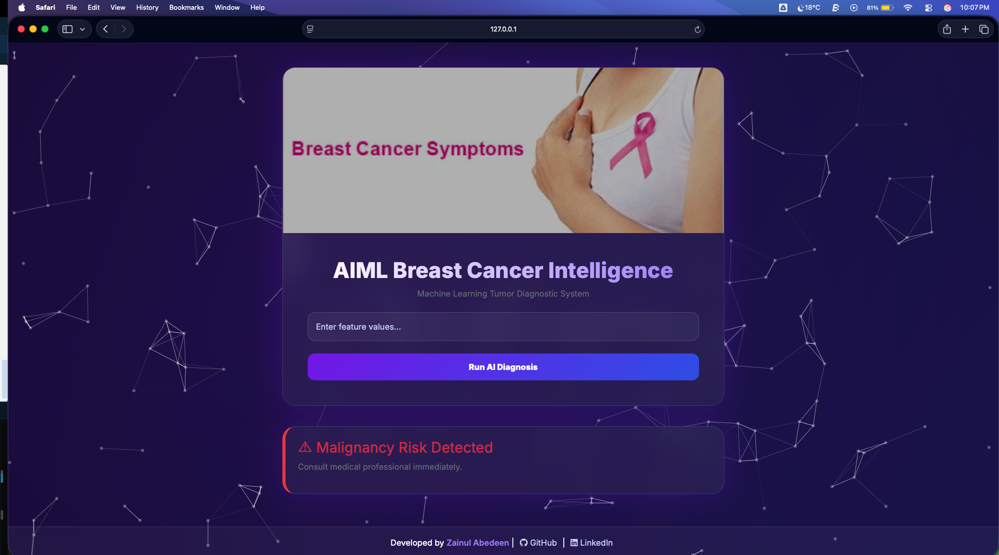

# 🧬 AIML Breast Cancer Intelligence

<p align="center">
  
</p>

An intelligent **Machine Learning powered web application** that predicts whether a breast tumor is **Benign** or **Malignant** using clinical diagnostic features.

This system assists in early breast cancer risk identification using trained ML models and an interactive web interface.

---

## 🚀 Project Overview

Breast cancer is one of the leading causes of cancer-related deaths worldwide. Early detection significantly improves treatment outcomes.

This project uses **Machine Learning algorithms (NOT Deep Learning)** to analyze tumor characteristics and predict cancer diagnosis through a user-friendly AI interface.

The application allows users to input medical feature values and instantly receive prediction results.

---

## 🧠 Machine Learning Approach

Unlike Deep Learning systems, this project uses **classical supervised Machine Learning techniques**.

### ✔ Workflow

1. Data Collection
2. Data Preprocessing
3. Feature Scaling
4. Model Training
5. Model Evaluation
6. Model Serialization
7. Flask Web Deployment

---

## 📊 Dataset Used

- **Breast Cancer Wisconsin Diagnostic Dataset**
- Available via:
  - Scikit-learn Dataset Repository
  - UCI Machine Learning Repository

### Dataset Features Include:

- Radius Mean
- Texture Mean
- Perimeter Mean
- Area Mean
- Smoothness
- Compactness
- Concavity
- Symmetry
- Fractal Dimension
- and other cellular characteristics

---

## ⚙️ Machine Learning Model

The prediction model is built using:

- ✅ Logistic Regression *(depending on your model)*
- ✅ Scikit-learn
- ✅ Feature Scaling using StandardScaler

> ⚠️ Note:
> This project uses **Machine Learning (ML)** techniques and **does NOT use Deep Learning or Neural Networks**.

---

## 🏗️ Tech Stack

### Backend

- Python
- Flask
- Scikit-learn
- NumPy
- Pandas
- Pickle

### Frontend

- HTML5
- CSS3
- Bootstrap 5
- JavaScript
- Particles.js Animation

---

## 🖥️ Application Interface

<p align="center">
  
</p>

Features included:

✅ ML-powered prediction system
✅ Interactive medical UI
✅ Real-time prediction results
✅ Animated loader during analysis
✅ Glassmorphism modern design
✅ Responsive layout

---

## 📂 Project Structure

```

BreastCancer/
│
├── app.py
│
├── models/
│   └── model.pkl
│
├── templates/
│   └── index.html
│
├── static/
│   └── breast_cancer.jpg
│
├── requirements.txt
│
└── README.md

```

---

## ⚡ Installation & Setup

### 1️⃣ Clone Repository

```bash
git clone https://github.com/zainulabedeen589/Breast-Cancer-Intelligence.git
cd Breast-Cancer-Intelligence
```

---

### 2️⃣ Create Virtual Environment

```bash
python -m venv venv
```

Activate environment:

**Windows**

```bash
venv\Scripts\activate
```

**Mac/Linux**

```bash
source venv/bin/activate
```

---

### 3️⃣ Install Dependencies

```bash
pip install -r requirements.txt
```

---

### 4️⃣ Run Application

```bash
python app.py
```

Open browser:

```
http://127.0.0.1:5000/
```

---

## 🧪 Model Prediction

User inputs diagnostic feature values:

```
2.13018192e-01, -5.90201273e-01,  2.78151024e-01,
         7.93179680e-02,  1.47083851e+00,  1.16919292e+00,
         1.00908719e+00,  1.07711474e+00,  1.26019637e+00,
         6.83612567e-01,  8.69160837e-02, -4.68975381e-01,
         6.31952291e-02,  2.34972050e-02, -1.33445566e-03,
        -2.93138093e-04, -8.45111045e-02,  1.29797207e-01,
        -5.57825655e-01,  2.28242912e-02,  5.35769651e-01,
         3.02768997e-01,  5.99822963e-01,  3.84469578e-01,
         2.44036784e+00,  1.26100069e+00,  9.36116234e-01,
         1.35650577e+00,  1.07793067e+00,  1.26945274e+00
```

System outputs:

✅ Benign Tissue Detected
⚠ Malignancy Risk Detected

---

## 📈 Model Evaluation Metrics

Typical evaluation metrics used:

* Accuracy Score
* Confusion Matrix
* Precision
* Recall
* F1 Score

---

## ⚠ Disclaimer

This system is developed **for educational and research purposes only**.

It is **not intended for real medical diagnosis** or clinical decision-making.

Always consult certified healthcare professionals.

---

## 👨‍💻 Developer

**Zainul Abedeen**

GitHub: [https://github.com/zainulabedeen589](https://github.com/zainulabedeen589) \
LinkedIn: [https://linkedin.com/in/zainulabedeen589](https://linkedin.com/in/zainulabedeen589)

---

## 🌟 Future Improvements

* Prediction confidence score
* Model comparison dashboard
* Patient history tracking
* Cloud deployment
* API integration
* Explainable AI (SHAP / LIME)

---

⭐ If you found this project useful, consider giving it a star!
